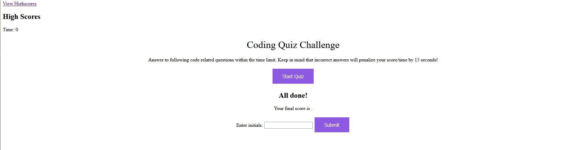

# WebAPICodeQuiz

## Description

    * This is a coding quiz with a functional timer that will decrease in time if you answer correctly and should have the functionality to record the highscores at once the quiz has been finished. 

    * The purpose of this project is build a functional quiz and further build upon my JavaScript knowledge and functional capabilites to build HTML sites.
    
## Installation 

    * No installation needed, should be able to run the site as is and answer questions then record highscore. 

## Usage

    * Site should look something like the following screenshot below: 

## Credits

Large portion of building this site can be attributed to MDN Docs
Some questions were taken from this online quiz [Javascript Quiz](https://www.codeconquest.com/coding-quizzes/javascript-knowledge-quiz-beginner/)